# ESCUELA POLITÉCNICA NACIONAL
## GRUPO 2 S.A.

---
Integrantes: 
- Chalacama Erick
- Davalos Mateo
- De Castro Eiden
- Dueñas Mateo
- Flores Britanny
- Fuertes José

Versión: 3.0
---

# Documentación de Ejecución de Pruebas

## Resumen de Ejecución

**Resultados Generales:**
- Total de Casos de Prueba Ejecutados: 11
- Casos de Prueba Exitosos: 11
- Casos de Prueba Fallidos: 0

## Casos de Prueba

### Caso de Prueba 1: Verificar Traducción Correcta
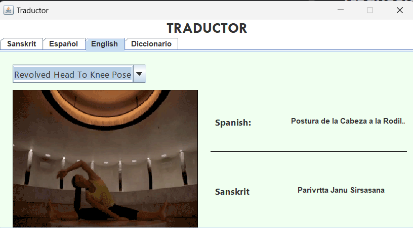

**Estado:** Exitoso

### Caso de Prueba 2: Ingresar Postura en Sánscrito
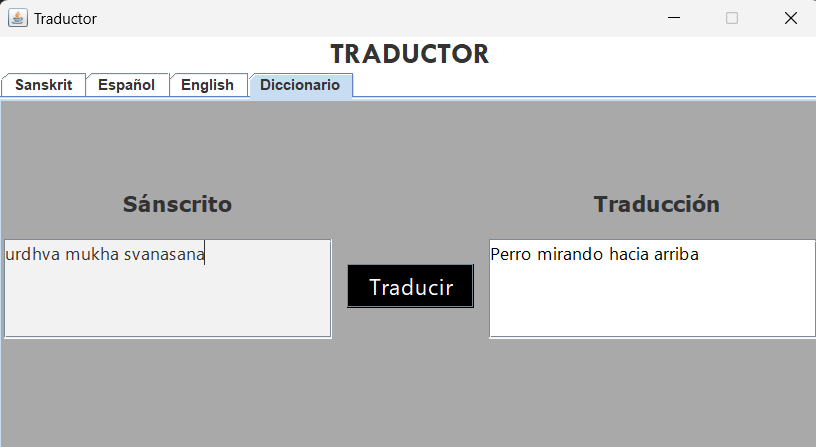

**Estado:** Exitoso

### Caso de Prueba 3: Visualización Gráfica de Posturas
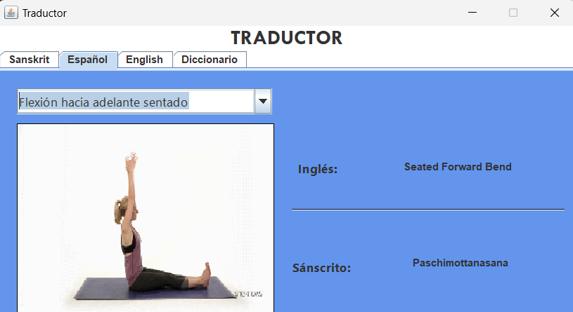

**Estado:** Exitoso

### Caso de Prueba 4: Acceso sin Conexión a Internet
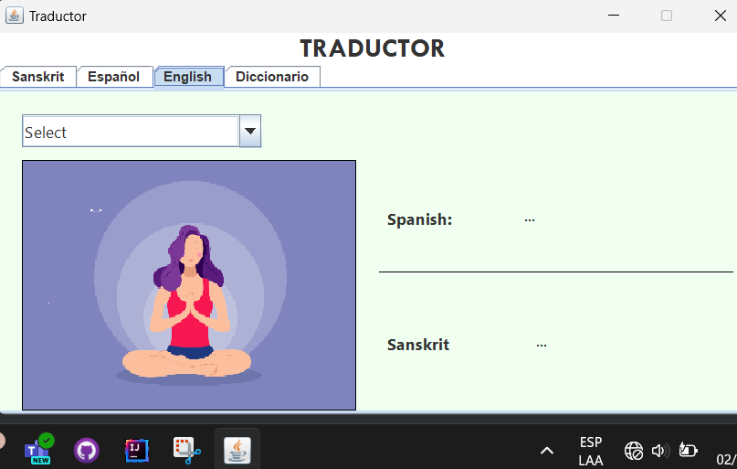

**Estado:** Exitoso

### Caso de Prueba 5: Usabilidad de la Interfaz
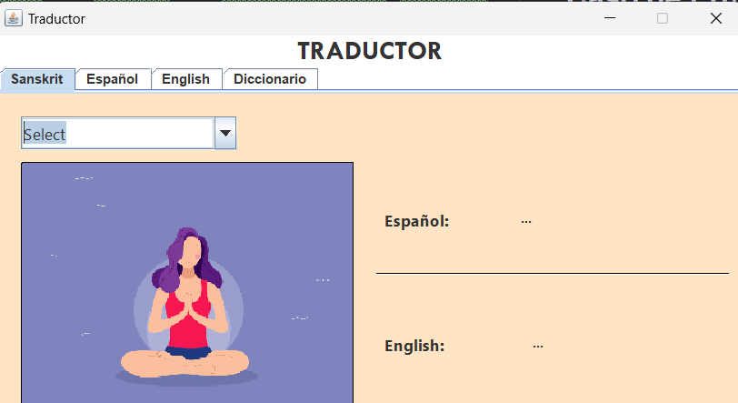

**Estado:** Exitoso

### Caso de Prueba 6: Autocompletar en la Búsqueda
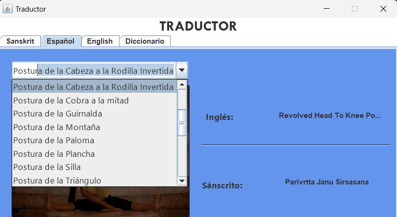

**Estado:** Exitoso

### Caso de Prueba 7: Validación en la Entrada de Texto
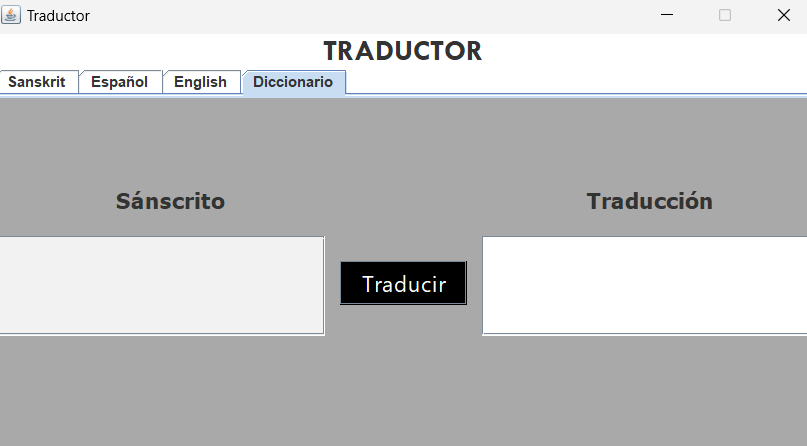

**Estado:** Exitoso

### Caso de Prueba 8: Validación en el Espacio de Traductor
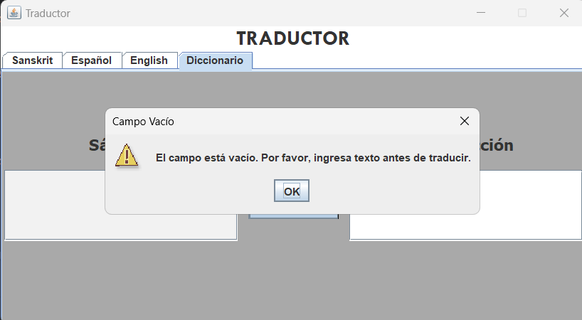

**Estado:** Exitoso

### Caso de Prueba 9: Traducción No Encontrada en el Diccionario
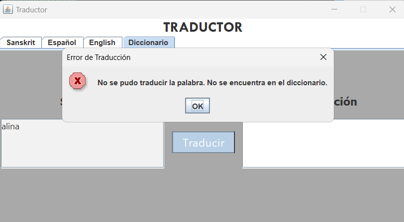

**Estado:** Exitoso

### Caso de Prueba 10: Rendimiento del Traductor
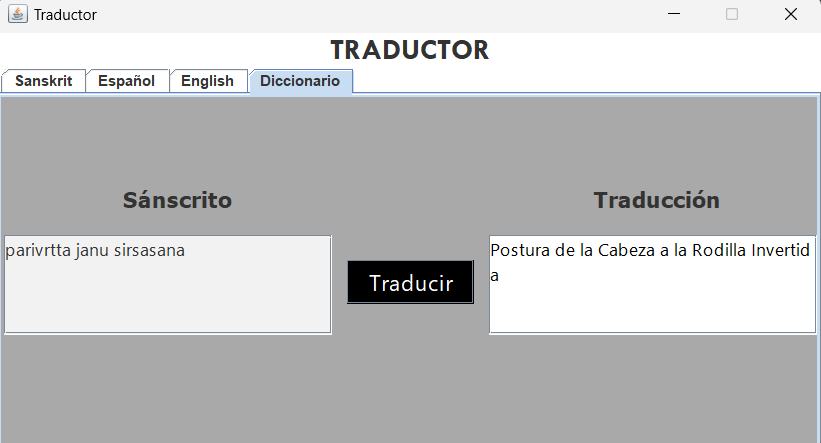

**Estado:** Exitoso

### Caso de Prueba 11: Disponibilidad del Servicio
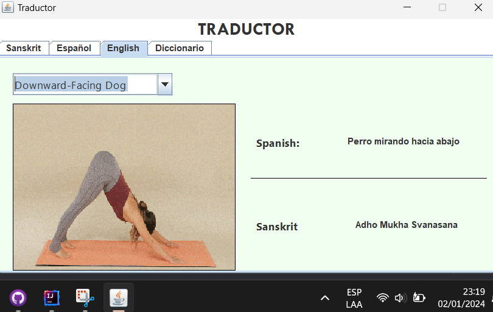

**Estado:** Exitoso

